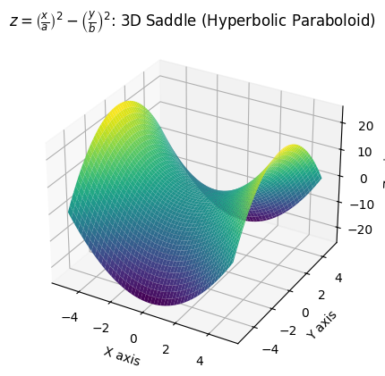

# Plot 3D Intro

This repository demonstrates various 3D plotting techniques using Python. It includes scripts to generate interactive 3D plots and static 3D plots of different mathematical functions.

## Directory Structure

```plaintext
.
├── images_out
│   ├── interactive_3d.png
│   ├── interactive_heart_3d.png
│   ├── saddle.png
│   └── torus.png
├── interactive_3d.py
├── plot_3d_heart.py
├── plot_3d_intro.py
```





